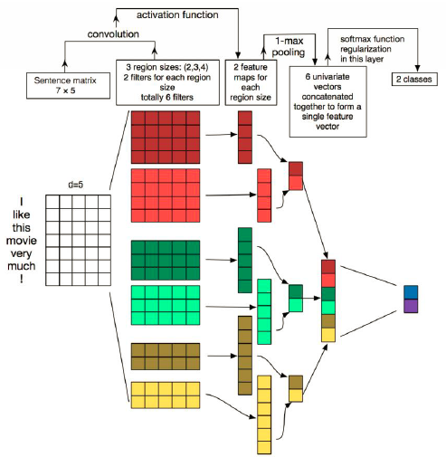
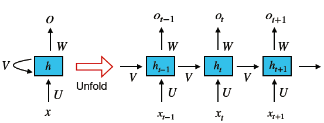
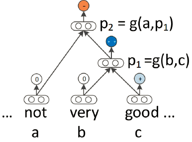
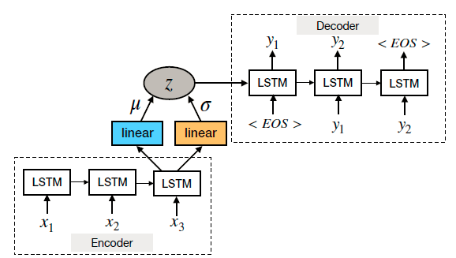

# NLP深度学习：近期趋势概述
> 原文链接：[Deep Learning for NLP: An Overview of Recent Trends](https://medium.com/dair-ai/deep-learning-for-nlp-an-overview-of-recent-trends-d0d8f40a776d)
>
> 作者：by [elvis](https://medium.com/@ibelmopan) on 2018-08-23
>
> 译者：by [sherlockyb](https://github.com/sherlockyb)

**目录**

* [NLP深度学习：近期趋势概述](#nlp%E6%B7%B1%E5%BA%A6%E5%AD%A6%E4%B9%A0%E8%BF%91%E6%9C%9F%E8%B6%8B%E5%8A%BF%E6%A6%82%E8%BF%B0)
  * [什么是NLP](#%E4%BB%80%E4%B9%88%E6%98%AFnlp)
  * [分布式表示](#%E5%88%86%E5%B8%83%E5%BC%8F%E8%A1%A8%E7%A4%BA)
  * [卷积神经网络（CNN）](#%E5%8D%B7%E7%A7%AF%E7%A5%9E%E7%BB%8F%E7%BD%91%E7%BB%9Ccnn)
  * [循环神经网络（RNN）](#%E5%BE%AA%E7%8E%AF%E7%A5%9E%E7%BB%8F%E7%BD%91%E7%BB%9Crnn)
  * [注意力机制](#%E6%B3%A8%E6%84%8F%E5%8A%9B%E6%9C%BA%E5%88%B6)
  * [递归神经网络](#%E9%80%92%E5%BD%92%E7%A5%9E%E7%BB%8F%E7%BD%91%E7%BB%9C)
  * [强化学习](#%E5%BC%BA%E5%8C%96%E5%AD%A6%E4%B9%A0)
  * [无监督学习](#%E6%97%A0%E7%9B%91%E7%9D%A3%E5%AD%A6%E4%B9%A0)
  * [深度生成模型](#%E6%B7%B1%E5%BA%A6%E7%94%9F%E6%88%90%E6%A8%A1%E5%9E%8B)
  * [记忆增强网络](#%E8%AE%B0%E5%BF%86%E5%A2%9E%E5%BC%BA%E7%BD%91%E7%BB%9C)
  * [总结](#%E6%80%BB%E7%BB%93)

在最近的新[论文](https://arxiv.org/abs/1708.02709)中，Young及其同事探讨了在基于深度学习的自然语言处理（NLP）系统和应用中的一些最新趋势。论文重点回顾和比较了已经在各种NLP任务如[视觉问答](https://tryolabs.com/blog/2018/03/01/introduction-to-visual-question-answering/)和[机器翻译](https://en.wikipedia.org/wiki/Machine_translation)等中取得了**state-of-the-art**结果的模型和方法。在这篇全面的综述中，读者将详细了解到深度学习在NLP中的过去、现在和未来。此外，读者还会学习到在NLP中应用深度学习的一些最佳实践，包含如下主题：

- 分布式表示的兴起（例如，word2vec）
- 卷积、循环、递归神经网络
- 强化学习的应用
- 无监督句子表示学习的最新进展
- 将深度学习模型与记忆增强策略相结合

## 什么是NLP

自然语言处理（NLP）旨在解决构建计算算法以自动分析和表示人类语言的问题。基于NLP的系统已经促成了广泛的应用，如Google强大的搜索引擎，以及最近亚马逊的语音助手Alexa。NLP还可用于训练机器执行复杂的自然语言相关任务的能力，例如机器翻译和对话生成。

长期以来，用于研究NLP问题的大多数方法都采用浅层机器学习模型和耗时的手工构造的特征。由于语言信息是由稀疏表征（高维特征）表示的，这导致诸如[维度灾难](https://en.wikipedia.org/wiki/Curse_of_dimensionality)之类的问题。然而随着最近词嵌入（低维，分布式表示）的普及和成功，与传统机器学习模型（如[SVM](https://en.wikipedia.org/wiki/Support_vector_machine)或[逻辑回归](https://en.wikipedia.org/wiki/Logistic_regression)）相比，基于神经的模型已在各种语言相关任务上取得了优异的成果。

## 分布式表示

如前所述，手工构造的特征主要用于建模自然语言任务，直到神经方法的出现并解决了传统机器学习模型所面临的一些问题，如维度灾难。

**词嵌入**：分布式向量，也称为词嵌入，基于所谓的[分布式假设](https://en.wikipedia.org/wiki/Distributional_semantics)——出现在类似语境中的词具有相似的含义。词嵌入是在目标为基于一个词的上下文预测该单词的任务上预训练的，通常使用浅层神经网络。下图说明了[Bengio及其同事](http://www.jmlr.org/papers/volume3/bengio03a/bengio03a.pdf)提出的神经语言模型：

词向量倾向于嵌入语法和语义信息，并在各种NLP任务中负责**SOTA**（state of the art）,例如[情感分析](https://en.wikipedia.org/wiki/Sentiment_analysis)和句子组成。

分布式表示在过去被大量用于研究各种NLP任务，而它真正才开始流行起来，则是在当连续词袋（CBOW）和skip-gram模型被引入该领域时。它们很受欢迎，因为它们可以有效地构建高质量词嵌入，因为它们可以用于语义组合（例如，`'man'+'royal'='king'`）。

**Word2vec**：2013年左右，[Mikolav](https://papers.nips.cc/paper/5021-distributed-representations-of-words-and-phrases-and-their-compositionality.pdf)等人提出了CBOW和skip-gram模型。CBOW是构建词嵌入的神经方法，目标是在给定已设定窗口大小的上下文单词计算目标单词的条件概率。另外，Skip-gram也是一个构建词嵌入的神经方法，它的目标是给定一个中心目标单词预测周围上下文单词（如条件概率）。对于这两种模型，单词嵌入维度都是通过计算（以无监督的方式）预测的准确率来确定的。

词嵌入方法的挑战之一是当我们想要获得诸如“hot potato”或“Boston Globe”之类的短语的向量表示时，我们不能简单地组合单个单词向量表示，因为这些短语并不代表单个词的含义组合。当考虑更长的短语和句子时，它会变得更加复杂。

word2vec模型的另一个限制则是当使用较小的窗口大小时，对于像“good”和“bad”这样的反义词，会产生相似的embeddings，这对于对这种区分很重要的任务是不可取的，例如情感分析。词嵌入的另一个警告是它们依赖于使用它们的应用。为每个新任务重新训练任务特定的embeddings是一个探索性的选择，但这通常计算昂贵，并且能使用[负采样](http://mccormickml.com/2017/01/11/word2vec-tutorial-part-2-negative-sampling/)更有效地解决。Word2vec模型还存在其他问题，例如没有考虑词的[多义性](https://en.wikipedia.org/wiki/Polysemy)，以及其他可能从训练数据中浮现的偏见。

**字符嵌入**：对于像[词性标注](https://en.wikipedia.org/wiki/Part-of-speech_tagging)（**POS**）和[命名实体识别](https://en.wikipedia.org/wiki/Named-entity_recognition)（**NER**）等任务，查看单词中的形态信息（例如字符或其组合）是很有用的。这对于形式丰富的语言也很有用，例如葡萄牙语、西班牙语和中文。由于我们在字符级别分析文本，这种类型的embeddings有助于处理未登录词问题，因为在这之前我们需要很大的词汇表来表示句子，而为了高效计算的目的我们还得压缩词汇表，现在我们不需要这么做。

最后，我们要理解很重要的一点是，尽管字符级和词级嵌入都已被成功应用于各种NLP任务，但它的长期影响仍受到质疑。例如，[Lucy and Gauthier](https://arxiv.org/abs/1705.11168)最近发现，词向量在如何很好地捕获单词背后概念意义的不同方面这点上是受限的。换句话说，仅有分布式语义，并不能用于理解单词背后的概念。最近，在自然语言处理系统的背景下，对意义表征进行了[重要的辩论](https://medium.com/huggingface/learning-meaning-in-natural-language-processing-the-semantics-mega-thread-9c0332dfe28e)。

## 卷积神经网络（CNN）

CNN基本上是一个基于神经的方法，其表示用于构成单词或n-grams的特征函数，以提取更高级的特征。由此产生的抽象特征已被有效地用于情感分析，机器翻译和问答，以及其他任务。[Collobert and Weston](https://ronan.collobert.com/pub/matos/2008_nlp_icml.pdf)是首批将基于CNN的框架应用于NLP任务的研究人员之一。他们方法的目标是通过查找表将单词转换为向量表示，从而产生一种原始词嵌入方法，在网络训练期间学习权重（见下图）：

为了用基本的CNN进行句子建模，首先将句子tokenize为单词，然后将其进一步变为`d`维的词嵌入矩阵（例如输入embedding层）。然后，在该输入embedding层上应用卷积filters，其包括应用所有可能窗口大小的filters以产生所谓的特征映射（feature-map）。然后进行最大池化（max-pooling）操作，即对每个filter应用max操作以获得固定长度的输出并减小输出的维度，这样便产生了最终的句子表示。

通过增加上述基本CNN的复杂度，并使其适用于基于词的预测，可以研究如NER、[aspect detection](https://link.springer.com/chapter/10.1007/978-3-642-38824-8_12)、POS等其他NLP任务。这需要基于窗口的方法，其对于每个单词只考虑固定窗口大小的相邻单词（sub-sentence）。然后将单独的CNN应用于sub-sentence，而且其训练目标就是预测窗口中心的单词，这也被称为单词级别的分类。

基本CNN的一个缺点是无法建模长距离依赖关系，而这关系对于各种NLP任务则是相当重要的。为了解决该问题，CNN已与时间延时神经网络（TDNN）结合，后者能在训练期间立刻获得更大的上下文范围。其他有用的CNN变体已在不同的NLP任务中取得成功，例如情感预测和问题类型分类，被称为动态卷积神经网络（DCNN）。DCNN使用动态的k-max池化策略，其filters可以在句子建模时动态地跨越可变的范围。

CNNs也已被用于更复杂的任务，其文本是变长的，例如aspect detection、[情感分析](https://arxiv.org/abs/1609.02748)、[短文本分类](http://www.aclweb.org/anthology/P15-2058)、[讽刺识别](https://medium.com/dair-ai/detecting-sarcasm-with-deep-convolutional-neural-networks-4a0657f79e80)。然而这其中的一些研究报告说，在将基于CNN的方法应用于Twitter等微缩文本时，外部知识是必要的。其他CNN已证明有效的任务是[查询-文档匹配](http://acl2014.org/acl2014/P14-2/pdf/P14-2105.pdf)、语音识别、机器翻译、问答表示等。另一方面，DCNN被用于自动文本摘要，分层学习以捕获并组合低级词汇特征为高级语义概念。

总体而言，CNN是有效的，因为它们可以在上下文窗口中挖据语义线索，但是它们难以保持序列顺序和建模长距离上下文信息。循环模型更适合这种类型的学习，接下来将对它们进行探讨。

## 循环神经网络（RNN）

RNN是一种特殊的基于神经的方法，能有效处理序列信息。RNN递归地计算输入序列的每一个实例，并且计算时以先前计算的结果为条件输入。这些序列通常由token的固定大小的向量组成，这些向量被按序地（逐个）传入循环单元。下图说明了一个简单RNN框架：

RNN的主要优势在于能记忆先前计算的结果并在当前计算中使用该信息。这使得RNN模型适合于对任意长度的输入中的上下文关系进行建模，以便创建inputs的适当组合。RNN已被用于研究各种NLP任务，例如机器翻译、图像字幕、语言模型等。

与CNN模型相比，RNN模型在特定的自然语言任务中可以同样有效甚至更好，但这并不是说RNN更高级。因为这两种模型分别建模数据的不同方面，它们是否有效，取决于当前任务所需要的语义。

RNN的输入通常是one-hot编码或词向量，但在某些情况下，会与其他模型构造的抽象表示相结合，比如说CNN模型。简单的RNN存在[梯度消失问题](https://en.wikipedia.org/wiki/Vanishing_gradient_problem)，这使得它难以学习和调整较早层中的参数。其他变体，如[长短期记忆（LSTM）网络](https://en.wikipedia.org/wiki/Long_short-term_memory)、[残差网络（ResNets）](https://en.wikipedia.org/wiki/Residual_neural_network)和[门控循环网络（GRU）](https://en.wikipedia.org/wiki/Gated_recurrent_unit)后来被引入以克服这一限制。

***RNN变体***：LSTM由三个门（input、forget、output门）组成，并通过三者的组合计算hidden state。GRU类似于LSTM，但它只包含两个门，效率更高，因为它们不那么复杂。一项[研究](https://arxiv.org/abs/1412.3555)表明，很难说哪种门控RNN更有效，通常根据可用的计算能力来挑选它们。人们已经提出各种基于LSTM的模型用于序列到序列映射（编码-解码框架），其适用于机器翻译、文本摘要、人工对话建模、问答系统、基于图像的语言生成以及其他任务。

总的来说，RNN用于许多NLP应用，例如：

- 词级别分类（例如NER）
- 语言建模
- 句子级别分类（例如，情感极性）
- 语义匹配（例如在对话系统中，将消息与候选回应相匹配）
- 自然语言生成（例如，机器翻译、视觉QA和图像字幕）

## 注意力机制

本质上，[注意力机制](http://www.wildml.com/2016/01/attention-and-memory-in-deep-learning-and-nlp/)是从需要允许上述基于RNN框架的解码器部分使用最后的隐藏状态以及基于输入隐藏状态序列计算的信息（如，上下文向量）而启发的技术。这对于需要在输入和输出文本之间需要某种对其的任务特别有益。

注意力机制已被成功运用于[机器翻译](https://arxiv.org/abs/1409.0473)、文本摘要、[图像字幕](https://arxiv.org/abs/1502.03044)、对话生成和[基于aspect的情感分析](https://aclweb.org/anthology/D16-1058)。人们已经提出了各种不同形式和类型的注意力机制，它们仍然是NLP研究者研究各种应用的重要研究领域。

## 递归神经网络

与RNN类似，递归神经网络是对序列数据建模的自然机制。这是因为语言可以被视为递归结构，其中单词和子短语构成层次结构中其他更高级别的短语。在这种结构中，非终端节点由其所有子节点的表示来表示。下图说明了一个简单的递归神经网络：

在基本的递归神经网络形式中，组合函数（即，网络）以自底向上的方式组合成分以计算高级短语的表示（参见上图）。在变体[MV-RNN](https://ai.stanford.edu/~ang/papers/emnlp12-SemanticCompositionalityRecursiveMatrixVectorSpaces.pdf)中，单词由矩阵和向量表示，这意味着网络学习的参数表示每个成分（单词或短语）的矩阵。另一种变体，[递归神经张量网络（RNTN）](https://skymind.ai/wiki/recursive-neural-tensor-network)，使得输入向量之间能够进行更多的交互，从而避免像MV-RNN那样的大参数。递归神经网络具有灵活性，并且它们已经与LSTM单元结合以处理诸如梯度消失之类的问题。

递归神经网络用于各种应用，例如：

- 句法解析
- 利用短语级表示进行情感分析
- 语义关系分类（例如主题消息）
- 句子关联性

## 强化学习

强化学习包括机器学习方法，训练代理执行离散动作，然后奖励。人们正在通过强化学习来研究若干个自然语言生成（NLG）任务，如文本摘要。

强化学习在NLP问题中的应用受到一些问题的启发。当使用基于RNN的生成器时，真实的tokens被模型生成的tokens所代替，这会迅速增加错误率。此外，对于这样的模型，词级别训练目标不同于机器翻译和对话系统中使用的测试度量，如n-gram重叠度量、[BLEU](https://en.wikipedia.org/wiki/BLEU)。由于这种差异，当前NLG类型的系统倾向于产生不连贯、重复、枯燥的信息。

为了解决上述问题，采用称为[REINFORCE](http://www-anw.cs.umass.edu/~barto/courses/cs687/williams92simple.pdf)的强化算法来处理NLP任务，例如[图像字幕和机器翻译](https://arxiv.org/abs/1511.06732)。该强化学习框架由Agent（基于RNN的生成模型）组成，该模型与外部环境（输入单词和每个时间步看到的上下文向量）交互。代理根据策略（参数）来选择一个动作，该策略涉及在每个时间步预测序列的下一个单词。然后代理更新其内部状态（RNN的隐藏单元）。这一直持续到到达序列的尾部，此时奖励被最终计算。奖励函数因任务而异，例如，在句子生成任务中，奖励可以是信息流。

尽管强化学习方法表现出良好的效果，但它们需要适当地处理动作和状态空间，这可能限制了模型的表达能力和学习能力。请记住，独立的基于RNN的模型致力于它们的表达能力和建模语言的自然能力。

对抗训练也被用于训练语言生成器，其目的是欺骗训练有素的鉴别器，以区分生成的序列和真实的序列。考虑一个对话系统，通过策略梯度，有可能在强化学习范式下构建任务，其中鉴别器就像人类图灵测试仪一样。鉴别器基本上被训练以区分人类和机器生成的对话。

## 无监督学习

无监督的句子表示学习涉及以无监督的方式将句子映射到固定大小的向量。分布式表示从语言捕获语义和句法属性，并使用辅助任务来训练。

类似于用于学习词嵌入的算法，有学者提出一种[skip-thought模型](https://arxiv.org/abs/1506.06726)，其任务是基于中心句子预测下一个相邻句子。该模型使用seq2seq框架进行训练，在该框架中，解码器生成目标序列，而编码器被视为通用特征提取器，甚至在该过程中学习到了词嵌入。该模型本质上是学习输入句子的分布式表示，类似于以前的语言建模技术中如何为每个单词学习单词嵌入。

## 深度生成模型

深度生成模型，如[变分自动编码器（VAE）](http://kvfrans.com/variational-autoencoders-explained/)和[生成对抗网络（GAN）](https://en.wikipedia.org/wiki/Generative_adversarial_network)，也被用于NLP，以通过从潜在代码空间生成逼真句子的过程来发现自然语言中的丰富结构。

众所周知，标准的句子自动编码器由于无约束的潜在空间而不能生成逼真的句子。VAE对隐藏的潜在空间施加先验分布，使模型能生成适当的样本。VAE由编码器和生成器网络组成，其将输入编码到潜在空间中，然后从潜在空间中生成样本。训练目标是在生成模型下最大化观测数据的对数似然的变分下界。下图说明了用于句子生成的基于RNN的VAE：

生成模型对于许多NLP任务是有用的，并且它们在本质上是灵活的。例如，基于RNN的VAE生成模型被提出用于产生比标准自动编码器更多样化和格式良好的句子。其他模型允许将结构化变量（例如，时态和情绪）合并到潜在代码中，以产生似乎合理的句子。

GAN由两个相互竞争的网络——生成器和鉴别器组成，也被用于生成逼真的文本。例如，使用LSTM作为生成器，使用CNN作为鉴别器，对实际数据和生成的样本进行鉴别。在这种情况下，CNN表示一个二元句子分类器。该模型能在对抗训练后生成逼真的文本。

除了鉴别器的梯度不能通过离散变量适当地反向传播的问题外，深度生成模型的评估也很困难。近年来，已经提出了许多解决方案，但这些方案尚未被标准化。

## 记忆增强网络

在token生成阶段由注意力机制访问的隐藏向量表示模型的“内部记忆”。神经网络还可以与某种形式的记忆结合，以解决[视觉QA](https://arxiv.org/abs/1603.01417)、[语言建模](https://arxiv.org/abs/1503.08895)、[POS标记](https://arxiv.org/abs/1506.07285)、[情感分析](https://arxiv.org/abs/1506.07285)等任务。例如，为了解决QA任务，将支持的事实或常识知识以记忆的形式提供给模型。[动态记忆网络](https://arxiv.org/abs/1603.01417)是对以往基于记忆模型的改进，其采用神经网络模型用于输入表示、注意力和应答机制。

## 总结

到目前为止，我们现在已经知道了基于神经网络的模型（如CNN和RNN）的能力和有效性。我们也意识到将强化学习、无监督方法和深度生成模式应用于复杂的NLP任务（如视觉QA和机器翻译）的可能性。注意力机制和记忆增强网络在扩展基于神经的NLP模型的能力方面是强大的。下一波基于语言的学习算法将带来更大的能力，如常识和建模复杂的人类行为。

***注意：*** 我们把这个总结的在线版本放在一个专门的网址上（[nlpoverview.com](https://nlpoverview.com/)）。与社区一起，我们将继续更新这个[项目](https://github.com/omarsar/nlp_overview)。

***参考：*** “[Recent Trends in Deep Learning Based Natural Language Processing](https://arxiv.org/abs/1708.02709)”——Tom Young, Devamanyu Hazarika, Soujanya Poria, and Erik Cambria. IEEE Computational Intelligence Magazine, 2018.