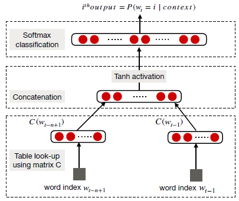
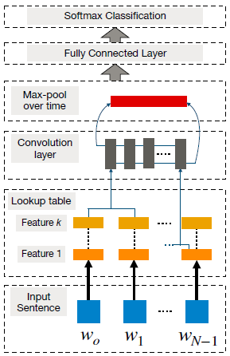
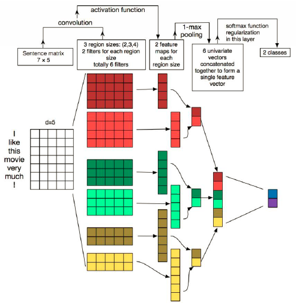

# NLP深度学习：近期趋势概述
> 原文链接：[Deep Learning for NLP: An Overview of Recent Trends](https://medium.com/dair-ai/deep-learning-for-nlp-an-overview-of-recent-trends-d0d8f40a776d)
>
> 作者：by [elvis](https://medium.com/@ibelmopan) on 2018-08-23
>
> 译者：by [sherlockyb](https://github.com/sherlockyb)

在最近的新[论文](https://arxiv.org/abs/1708.02709)中，Young及其同事探讨了在基于深度学习的自然语言处理（NLP）系统和应用中的一些最新趋势。论文重点回顾和比较了已经在各种NLP任务如[视觉问答](https://tryolabs.com/blog/2018/03/01/introduction-to-visual-question-answering/)和[机器翻译](https://en.wikipedia.org/wiki/Machine_translation)等中取得了**state-of-the-art**结果的模型和方法。在这篇全面的综述中，读者将详细了解到深度学习在NLP中的过去、现在和未来。此外，读者还会学习到在NLP中应用深度学习的一些最佳实践，包含如下主题：

- 分布式表示的兴起（例如，word2vec）
- 卷积、循环、递归神经网络
- 强化学习的应用
- 无监督句子表示学习的最新进展
- 将深度学习模型与记忆增强策略相结合

## 什么是NLP

自然语言处理（NLP）旨在解决构建计算算法以自动分析和表示人类语言的问题。基于NLP的系统已经促成了广泛的应用，如Google强大的搜索引擎，以及最近亚马逊的语音助手Alexa。NLP还可用于训练机器执行复杂的自然语言相关任务的能力，例如机器翻译和对话生成。

长期以来，用于研究NLP问题的大多数方法都采用浅层机器学习模型和耗时的手工构造的特征。由于语言信息是由稀疏表征（高维特征）表示的，这导致诸如[维度灾难](https://en.wikipedia.org/wiki/Curse_of_dimensionality)之类的问题。然而随着最近词嵌入（低维，分布式表示）的普及和成功，与传统机器学习模型（如[SVM](https://en.wikipedia.org/wiki/Support_vector_machine)或[逻辑回归](https://en.wikipedia.org/wiki/Logistic_regression)）相比，基于神经的模型已在各种语言相关任务上取得了优异的成果。

## 分布式表示

如前所述，手工构造的特征主要用于建模自然语言任务，直到神经方法的出现并解决了传统机器学习模型所面临的一些问题，如维度灾难。

**词嵌入**：分布式向量，也称为词嵌入，基于所谓的[分布式假设](https://en.wikipedia.org/wiki/Distributional_semantics)——出现在类似语境中的词具有相似的含义。词嵌入是在目标为基于一个词的上下文预测该单词的任务上预训练的，通常使用浅层神经网络。下图说明了[Bengio及其同事](http://www.jmlr.org/papers/volume3/bengio03a/bengio03a.pdf)提出的神经语言模型：

词向量倾向于嵌入语法和语义信息，并在各种NLP任务中负责**SOTA**（state of the art）,例如[情感分析](https://en.wikipedia.org/wiki/Sentiment_analysis)和句子组成。

分布式表示在过去被大量用于研究各种NLP任务，而它真正才开始流行起来，则是在当连续词袋（CBOW）和skip-gram模型被引入该领域时。它们很受欢迎，因为它们可以有效地构建高质量词嵌入，因为它们可以用于语义组合（例如，`'man'+'royal'='king'`）。

**Word2vec**：2013年左右，[Mikolav](https://papers.nips.cc/paper/5021-distributed-representations-of-words-and-phrases-and-their-compositionality.pdf)等人提出了CBOW和skip-gram模型。CBOW是构建词嵌入的神经方法，目标是在给定已设定窗口大小的上下文单词计算目标单词的条件概率。另外，Skip-gram也是一个构建词嵌入的神经方法，它的目标是给定一个中心目标单词预测周围上下文单词（如条件概率）。对于这两种模型，单词嵌入维度都是通过计算（以无监督的方式）预测的准确率来确定的。

词嵌入方法的挑战之一是当我们想要获得诸如“hot potato”或“Boston Globe”之类的短语的向量表示时，我们不能简单地组合单个单词向量表示，因为这些短语并不代表单个词的含义组合。当考虑更长的短语和句子时，它会变得更加复杂。

word2vec模型的另一个限制则是当使用较小的窗口大小时，对于像“good”和“bad”这样的反义词，会产生相似的embeddings，这对于对这种区分很重要的任务是不可取的，例如情感分析。词嵌入的另一个警告是它们依赖于使用它们的应用。为每个新任务重新训练任务特定的embeddings是一个探索性的选择，但这通常计算昂贵，并且能使用[负采样](http://mccormickml.com/2017/01/11/word2vec-tutorial-part-2-negative-sampling/)更有效地解决。Word2vec模型还存在其他问题，例如没有考虑词的[多义性](https://en.wikipedia.org/wiki/Polysemy)，以及其他可能从训练数据中浮现的偏见。

**字符嵌入**：对于像[词性标注](https://en.wikipedia.org/wiki/Part-of-speech_tagging)（**POS**）和[命名实体识别](https://en.wikipedia.org/wiki/Named-entity_recognition)（**NER**）等任务，查看单词中的形态信息（例如字符或其组合）是很有用的。这对于形式丰富的语言也很有用，例如葡萄牙语、西班牙语和中文。由于我们在字符级别分析文本，这种类型的embeddings有助于处理未登录词问题，因为在这之前我们需要很大的词汇表来表示句子，而为了高效计算的目的我们还得压缩词汇表，现在我们不需要这么做。

最后，我们要理解很重要的一点是，尽管字符级和词级嵌入都已被成功应用于各种NLP任务，但它的长期影响仍受到质疑。例如，[Lucy and Gauthier](https://arxiv.org/abs/1705.11168)最近发现，词向量在如何很好地捕获单词背后概念意义的不同方面这点上是受限的。换句话说，仅有分布式语义，并不能用于理解单词背后的概念。最近，在自然语言处理系统的背景下，对意义表征进行了[重要的辩论](https://medium.com/huggingface/learning-meaning-in-natural-language-processing-the-semantics-mega-thread-9c0332dfe28e)。

## 卷积神经网络（CNN）

CNN基本上是一个基于神经的方法，其表示用于构成单词或n-grams的特征函数，以提取更高级的特征。由此产生的抽象特征已被有效地用于情感分析，机器翻译和问答，以及其他任务。[Collobert and Weston](https://ronan.collobert.com/pub/matos/2008_nlp_icml.pdf)是首批将基于CNN的框架应用于NLP任务的研究人员之一。他们方法的目标是通过查找表将单词转换为向量表示，从而产生一种原始词嵌入方法，在网络训练期间学习权重（见下图）：

为了用基本的CNN进行句子建模，首先将句子tokenize为单词，然后将其进一步变为`d`维的词嵌入矩阵（例如输入embedding层）。然后，在该输入embedding层上应用卷积filters，其包括应用所有可能窗口大小的filters以产生所谓的特征映射（feature-map）。然后进行最大池化（max-pooling）操作，即对每个filter应用max操作以获得固定长度的输出并减小输出的维度，这样便产生了最终的句子表示。

通过增加上述基本CNN的复杂度，并使其适用于基于词的预测，可以研究如NER、[aspect detection](https://link.springer.com/chapter/10.1007/978-3-642-38824-8_12)、POS等其他NLP任务。这需要基于窗口的方法，其对于每个单词只考虑固定窗口大小的相邻单词（sub-sentence）。然后将单独的CNN应用于sub-sentence，而且其训练目标就是预测窗口中心的单词，这也被称为单词级别的分类。

基本CNN的一个缺点是无法建模长距离依赖关系，而这关系对于各种NLP任务则是相当重要的。为了解决该问题，CNN已与时间延时神经网络（TDNN）结合，后者能在训练期间立刻获得更大的上下文范围。其他有用的CNN变体已在不同的NLP任务中取得成功，例如情感预测和问题类型分类，被称为动态卷积神经网络（DCNN）。DCNN使用动态的k-max池化策略，其filters可以在句子建模时动态地跨越可变的范围。

CNNs也已被用于更复杂的任务，其文本是变长的，例如aspect detection、[情感分析](https://arxiv.org/abs/1609.02748)、[短文本分类](http://www.aclweb.org/anthology/P15-2058)、[讽刺识别](https://medium.com/dair-ai/detecting-sarcasm-with-deep-convolutional-neural-networks-4a0657f79e80)。然而这其中的一些研究报告说，在将基于CNN的方法应用于Twitter等微缩文本时，外部知识是必要的。其他CNN已证明有效的任务是[查询-文档匹配](http://acl2014.org/acl2014/P14-2/pdf/P14-2105.pdf)、语音识别、机器翻译、问答表示等。另一方面，DCNN被用于自动文本摘要，分层学习以捕获并组合低级词汇特征为高级语义概念。

总体而言，CNN是有效的，因为它们可以在上下文窗口中挖据语义线索，但是它们难以保持序列顺序和建模长距离上下文信息。循环模型更适合这种类型的学习，接下来将对它们进行探讨。

## 循环神经网络（RNN）

RNN是一种特殊的基于神经的方法，能有效处理序列信息。RNN递归地计算输入序列的每一个实例，并且计算时以先前计算的结果为条件输入。这些序列通常由token的固定大小的向量组成，这些向量被按序地（逐个）传入循环单元。下图说明了一个简单RNN框架：

RNN的主要优势在于能记忆先前计算的结果并在当前计算中使用该信息。这使得RNN模型适合于对任意长度的输入中的上下文关系进行建模，以便创建inputs的适当组合。RNN已被用于研究各种NLP任务，例如机器翻译、图像字幕、语言模型等。